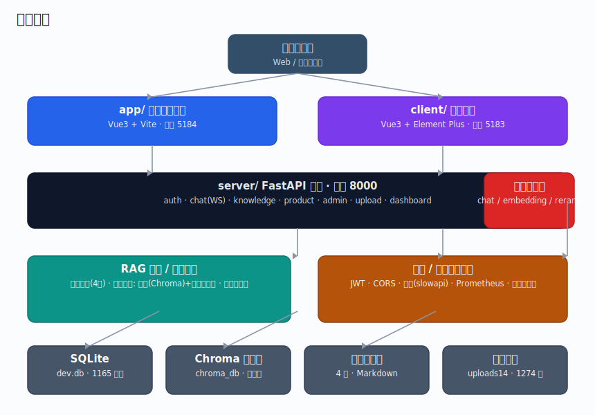
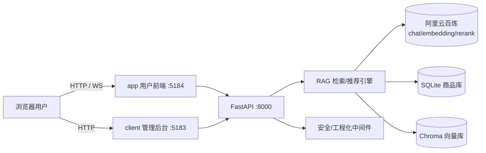
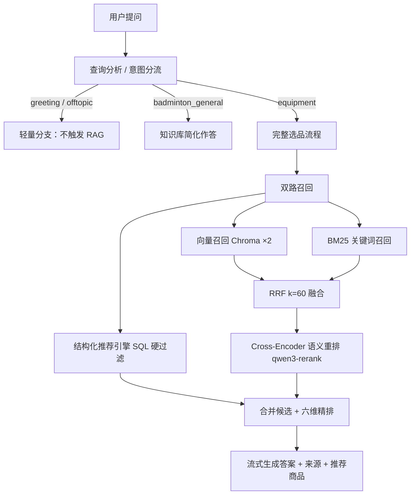
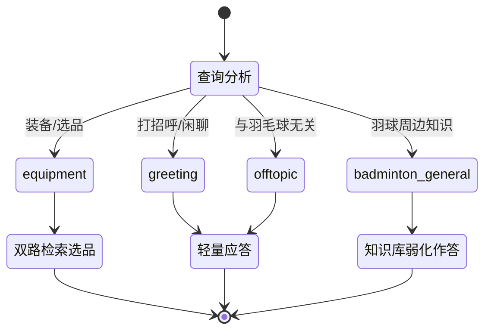
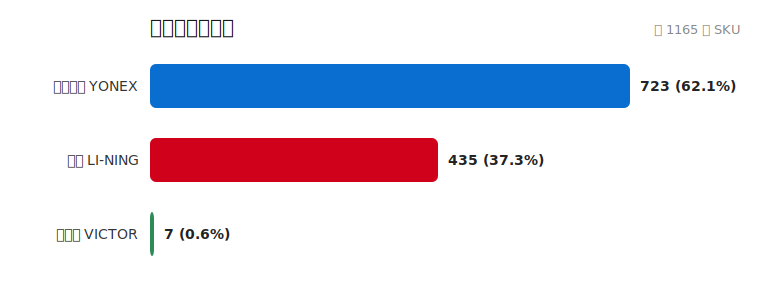
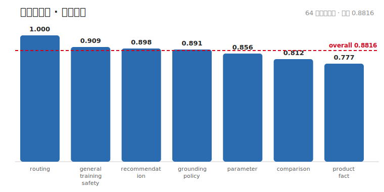
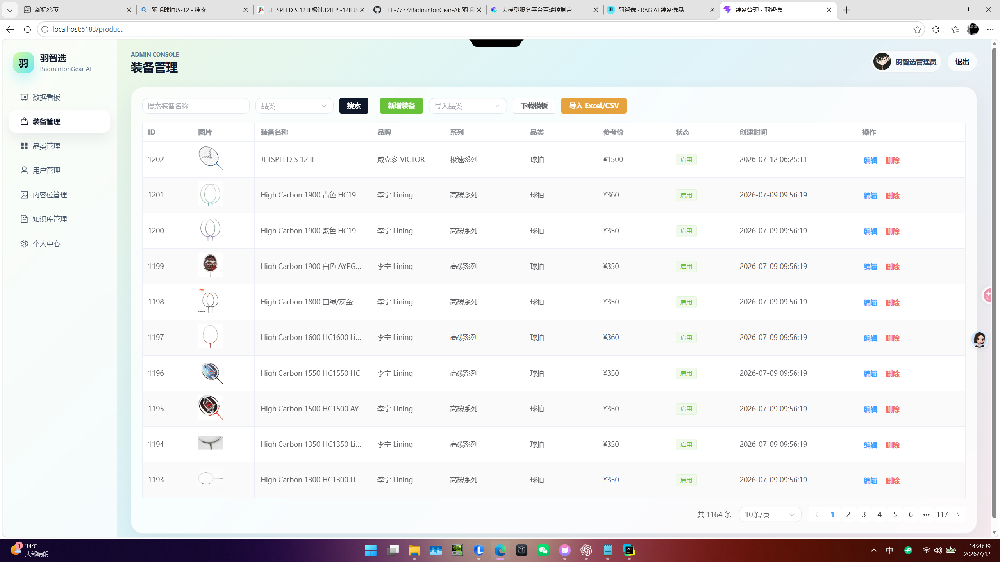
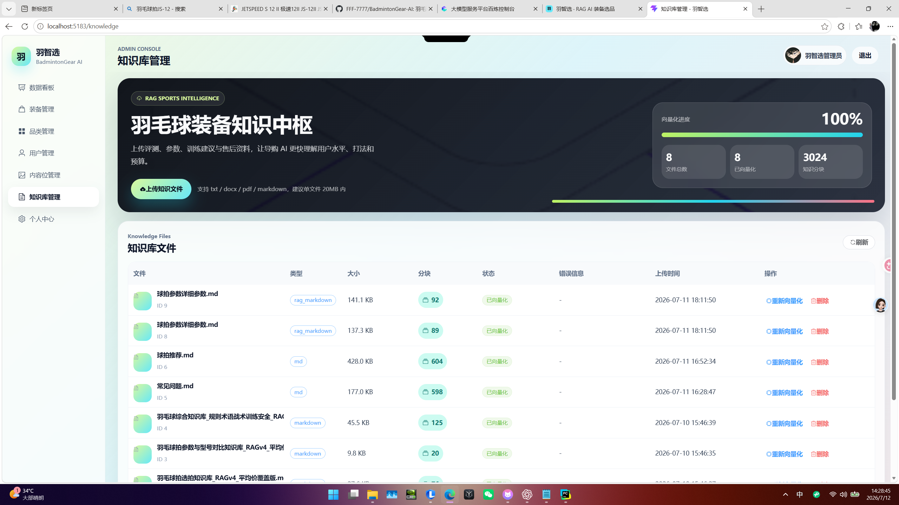
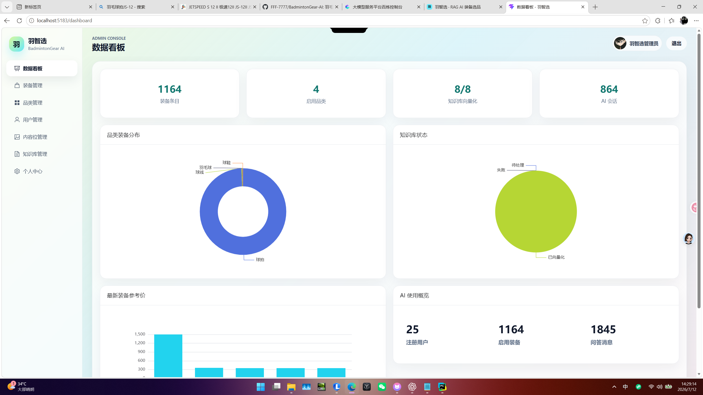

<p align="center">
  
</p>

<h1 align="center">羽智选 · BadmintonGear AI</h1>
<p align="center">羽毛球装备智能导购系统 · 基于 RAG 的检索增强生成 + 结构化推荐引擎</p>

<p align="center">
  
  
  
  
  
  
</p>

---

## 项目简介

**羽智选（BadmintonGear AI）** 是一套面向羽毛球爱好者的**装备智能导购系统**。用户用自然语言描述需求（水平、打法、预算、身体条件等），系统通过 **RAG 检索增强生成 + 结构化商品推荐引擎** 双路协同，给出可解释、可追溯、不编造的选品建议，并直接关联知识库来源与商品库 SKU。

系统由三部分组成：

| 模块 | 技术 | 端口 | 说明 |
| --- | --- | --- | --- |
| `app/` | Vue 3 + Vite + Vue Router | **5184** | 面向终端用户的聊天式导购前端 |
| `client/` | Vue 3 + Element Plus + Pinia | **5183** | 运营管理后台（商品 / 知识库 / 用户 / 看板） |
| `server/` | FastAPI + SQLAlchemy + Chroma | **8000** | 后端 API 与 AI 服务 |

---

## ✨ 核心特性

- **双路检索，杜绝幻觉**
  - 路径 A：知识库向量检索（Chroma，子进程隔离防 segfault）
  - 路径 B：结构化商品推荐引擎（SQL 硬过滤 + 加权评分 + 硬规则，参数**仅来自 `t_product.specs`**）
- **六维融合精排**：`final = 0.40·RRF + 0.15·dense + 0.15·lexical + 0.10·title + 0.10·metadata + 0.10·model`，短查询阈值自适应。
- **BM25 关键词召回 + Cross-Encoder 语义重排**（`qwen3-rerank`，主进程隔离，失败优雅降级）。
- **意图分流（4 类）**：`greeting` / `offtopic` 走轻量分支不触发 RAG；`badminton_general` 弱关联知识；`equipment` 进入完整选品流程。
- **跨会话用户画像**：`t_user_profile` 记录水平 / 打法 / 预算 / 身体条件，跨多轮对话持续补全，推荐更贴合。
- **工程化底座**：Docker 化部署、结构化日志、Prometheus 指标、深度健康检查、JWT + CORS + 限流、WS 首条消息认证、上传文件魔术字节校验。

---

## 🖥️ 产品界面预览

> 💡 以下两处为**用户聊天前端（`app/`，http://127.0.0.1:5184）**的真实界面截图占位。当前无原图，待补充。

### S1 · 用户聊天主界面

> 📷 **[截图占位 · S1]** 访问 http://127.0.0.1:5184，进行一次装备咨询对话（如「我是新手，预算 500，想要进攻拍」），截图完整对话窗口：**流式回答 + 来源引用 + 推荐商品卡片**。
> 保存为 `docs/screenshots/app-chat.png` 后，取消下方注释即可显示：
<!--  -->

### S2 · 跨会话画像 / 多轮对话

> 📷 **[截图占位 · S2]** 展示系统在多轮对话中「记住用户水平 / 预算 / 打法」的效果（可在 `t_user_profile` 有数据的前提下截图一段连续对话）。
> 保存为 `docs/screenshots/app-profile.png` 后，取消下方注释即可显示：
<!--  -->

---

## 🏗️ 系统架构

> 下图为依据当前代码真实结构绘制的分层架构。


**请求主链路**



---

## 🔍 RAG 检索与推荐流程



---

## 🧭 意图分流状态机



---

## 📊 数据规模（真实统计自 `server/dev.db`）

| 指标 | 数值 |
| --- | --- |
| 商品 SKU 总数（`t_product`） | **1,165** |
| 装备分类数（`t_category`） | 4 |
| 知识库文件（`t_knowledge_file`，已向量化） | 4 |
| 商品图片（`uploads14`） | 1,274 张（100% 有图） |
| 对话消息（`t_chat_message`） | 1,507 |
| 注册用户（`t_user`） | 22 |
| 跨会话画像（`t_user_profile`） | 5 |

**商品品牌分布**（按品牌名归一：YONEX 家族 723 / LI-NING 家族 435 / VICTOR 7）



---

## 📈 评测结果（真实评测产物，非编造）

> 评测集位于 `黄金集/badminton_rag_golden_set_v1_1_racket_only_full/`，共 **64 条确定性测试用例**（球拍类目），覆盖路由、参数、对比、推荐、知识溯源、训练安全等维度。

### 黄金集综合评分

- **总分 `overall_score` = 0.8816**
- 通过率（得分 ≥ 0.80）= **0.7656**

| 维度 (group) | 得分 |
| --- | --- |
| routing（意图路由） | 1.0000 |
| general_training_safety（训练安全） | 0.9092 |
| recommendation（推荐） | 0.8985 |
| grounding_policy（接地策略） | 0.8906 |
| parameter（参数建议） | 0.8562 |
| comparison（型号对比） | 0.8125 |
| product_fact（商品事实） | 0.7775 |



### DeepEval 全量交叉验证（64 例，裁判模型 `qwen3.6-flash`）

| 指标 | 数值 | 说明 |
| --- | --- | --- |
| Faithfulness（忠实度） | 0.8142 | 越高越好 |
| Answer Relevancy（相关性） | 0.8371 | 越高越好 |
| Contextual Recall（上下文召回） | 0.8024 | 越高越好 |
| Contextual Precision（上下文精度） | 0.7906 | 越高越好 |
| Hallucination（幻觉率） | 0.2008 | 越低越好 |
| 专业度 [GEval] | 0.8407 | 越高越好 |

> 注：裁判模型（`qwen3.6-flash`）与生成模型为不同款，可降低自评偏差；幻觉率 0.20 为诚实展示的已知上限，是持续优化的方向。

### S7 · 评测报告可视化（可选）

> 📷 **[截图占位 · S7 · 可选]** 若你有 DeepEval / 黄金集评测的可视化报告或运行终端输出，可截图展示（如 `deepeval` 报告页、pytest 评测汇总）。非必需。
> 保存为 `docs/screenshots/eval-report.png` 后，取消下方注释即可显示：
<!--  -->

---

## 🧱 技术栈

### 后端 `server/`

| 能力 | 选型 | 版本 |
| --- | --- | --- |
| Web 框架 | FastAPI | 0.138.1 |
| ASGI 服务器 | Uvicorn | 0.49.0 |
| ORM | SQLAlchemy | 2.0.51 |
| 数据校验 | Pydantic / pydantic-settings | 2.13.4 / 2.14.2 |
| 密码哈希 | bcrypt | 4.2.0 |
| 限流 | slowapi | 0.1.9 |
| 监控 | prometheus-client | 0.21.0 |
| 向量库 | chromadb | 1.5.9 |
| LLM 编排 | langchain / langchain-openai / langchain-chroma | 1.3.11 / 1.3.3 / 1.1.0 |
| 大模型 SDK | openai | 2.26.0 |

### 前端

| 模块 | 框架 | 关键依赖 |
| --- | --- | --- |
| `app/`（用户端） | Vue 3.4 + Vue Router 4 + Vite 8 | axios、vitest |
| `client/`（管理端） | Vue 3.5 + Element Plus 2.9 + Pinia 3 + Vite 8 | ECharts 6.1、axios |

### 大模型（阿里云百炼，OpenAI 兼容）

| 角色 | 模型 |
| --- | --- |
| 对话生成 | qwen 系列（经 `CHAT_MODEL` 可配置） |
| 文本向量 | `text-embedding-v4`（2048 维） |
| 语义重排 | `qwen3-rerank` |

---

## 🚀 快速开始

### 方式一：Docker Compose（推荐）

```bash
# 1. 准备环境变量
cp .env.example .env          # 然后填入 OPENAI_API_KEY、SECRET_KEY 等真实值
# 2. 构建并启动（后端 8000 / app 5174 / client 5173）
docker compose up --build
```

> 容器化部署下 `app` 暴露 5174、`client` 暴露 5173；本地开发分别使用 5184 / 5183。

### 方式二：本地开发

**后端**

```bash
cd server
python -m venv .venv && source .venv/bin/activate
pip install -r requirements.txt
cp ../.env.example .env        # 填入真实配置
python main.py                 # 自带 uvicorn reload，监听 8000
```

**用户前端**

```bash
cd app
npm install
npm run dev                    # http://127.0.0.1:5184
```

**管理后台**

```bash
cd client
npm install
npm run dev                    # http://127.0.0.1:5183
```

> ⚠️ 使用 Clash 等代理时，本地访问请使用 `127.0.0.1` 而非 `localhost`，避免被代理拦截。

---

## 🔌 API 概览

基础前缀 `/api`，主要路由如下：

| 路由前缀 | 能力 | 关键端点 |
| --- | --- | --- |
| `/auth` | 认证 | 管理员登录、用户登录、用户注册 |
| `/chat` | AI 客服 | `POST /send`、`WS /ws`（流式）、`GET /history` |
| `/knowledge` | 知识库 | 列表、后台上传、`/{id}/vectorize`、搜索测试、删除 |
| `/product` | 装备 | 列表、详情、后台增删改、导入模板、批量导入 |
| `/category` `/banner` | 基础数据 | 分类、轮播图 CRUD |
| `/admin/user` `/admin/profile` | 运营 | 用户管理、管理员资料 |
| `/user/profile` | 用户 | 个人资料、跨会话画像 |
| `/upload` | 文件 | 图片 / 头像上传（魔术字节校验） |
| `/dashboard` | 看板 | 数据统计 |
| 根路径 | 运维 | `GET /api/health`（深检 DB）、`GET /metrics`（Prometheus） |

---

## 🛡️ 运营管理后台

`client/`（Vue 3 + Element Plus + Pinia，http://127.0.0.1:5183）是面向运营的管理后台，提供商品 / 知识库 / 用户 / 看板等管理能力：

- **商品管理**：SKU 列表、搜索筛选、详情编辑、批量导入（模板下载 + Excel 导入）。
- **知识库管理**：文件上传、向量化状态跟踪（`t_knowledge_file`）、搜索测试、删除重建。
- **用户与画像**：注册用户管理、跨会话画像（`t_user_profile`）查看。
- **数据看板**：ECharts 可视化运营统计（`/dashboard`）。

> 💡 以下四处为管理后台真实界面截图占位，当前无原图，待补充。

### S3 · 商品管理

> 📷 **[截图占位 · S3]** 后台「商品管理」列表页：Element Plus 表格 + 搜索 / 筛选 / 分页，含商品名、品牌、价格、图片缩略图。
> 保存为 `docs/screenshots/admin-product.png` 后，取消下方注释即可显示：
<!--  -->

### S4 · 知识库管理

> 📷 **[截图占位 · S4]** 后台「知识库」页：已上传文件列表、向量化状态（status）、上传入口、搜索测试框。
> 保存为 `docs/screenshots/admin-knowledge.png` 后，取消下方注释即可显示：
<!--  -->

### S5 · 用户与跨会话画像

> 📷 **[截图占位 · S5]** 后台「用户管理 / 画像」页：用户列表与某用户的跨会话画像（水平 / 打法 / 预算 / 身体条件）。
> 保存为 `docs/screenshots/admin-user.png` 后，取消下方注释即可显示：
<!--  -->

### S6 · 数据看板

> 📷 **[截图占位 · S6]** 后台「数据看板」页：ECharts 图表展示商品 / 用户 / 对话等运营指标。
> 保存为 `docs/screenshots/admin-dashboard.png` 后，取消下方注释即可显示：
<!--  -->

---

## 🛠️ 工程化规范

- **静态检查**：`ruff`（E/F/W/I，line-length 120）+ `mypy`（Python 3.13，`warn_unused_ignores`）。
- **测试**：`pytest`（`tests/`），覆盖推荐引擎、用户画像与 RAG 管线。
- **前端规范**：ESLint + eslint-plugin-vue + Prettier（前后端各自配置）。
- **CI**：`.github/workflows/ci.yml` 自动执行 lint / type-check / test。
- **可观测性**：结构化 JSON 日志、深度健康检查 `/api/health`、Prometheus `/metrics`。
- **安全**：`SECRET_KEY` 强制环境变量（缺失即启动失败）、CORS 白名单、登录/注册/对话限流、WS 首条消息认证、上传文件魔术字节校验。
- **容器化**：`Dockerfile`（python:3.13-slim）+ `docker-compose.yml`（backend / app / client 三服务编排，卷持久化 `uploads14` 与 `chroma_db`）。

---

## 📁 目录结构

```text
羽智选 BadmintonGear AI/
├── server/                 # FastAPI 后端
│   ├── main.py             # 入口 / 健康检查 / 指标
│   ├── config.py           # 配置（环境变量驱动）
│   ├── bootstrap.py        # 数据库建表与种子
│   ├── routers/            # auth/chat/knowledge/product/admin...
│   ├── services/           # ai_service / rag_pipeline / vector_store / recommendation / chroma_runner
│   ├── models/ schemas/    # ORM 与校验模型
│   └── tests/              # pytest 用例
├── app/                    # 用户聊天前端 (Vue3+Vite, :5184)
├── client/                 # 管理后台 (Vue3+Element Plus, :5183)
├── scripts/                # 知识库重建 / 覆盖工具
├── docs/assets/            # README 自动生成图文（SVG）
├── docs/screenshots/       # README 界面截图（待补充，见下方清单）
├── Dockerfile
├── docker-compose.yml
├── pyproject.toml          # ruff / mypy / pytest 配置
└── .env.example            # 环境变量模板
```

> 数据集与素材（**黄金集** / **知识库** / **爬虫** / **uploads14**）为本地资源，由 `.gitignore` 管理，不纳入版本控制。

---

## 📸 截图待补充清单（占位符索引）

> 以下步骤将真实截图插入 README：
> 1. 按下方「保存路径」截图并放入 `docs/screenshots/`；
> 2. 在 README 中找到对应占位符（如 `[截图占位 · S1]`）；
> 3. 删除占位符下方那行 `<!--` 与 `-->` 注释符，图片即渲染。

| 占位符 | 章节 | 保存路径 | 截图内容 |
| --- | --- | --- | --- |
| **S1** | 产品界面预览 | `docs/screenshots/app-chat.png` | 用户聊天前端主界面（一次完整选品对话） |
| **S2** | 产品界面预览 | `docs/screenshots/app-profile.png` | 跨会话画像 / 多轮对话效果 |
| **S3** | 运营管理后台 | `docs/screenshots/admin-product.png` | 商品管理列表 |
| **S4** | 运营管理后台 | `docs/screenshots/admin-knowledge.png` | 知识库管理（上传 / 向量化） |
| **S5** | 运营管理后台 | `docs/screenshots/admin-user.png` | 用户管理 / 跨会话画像 |
| **S6** | 运营管理后台 | `docs/screenshots/admin-dashboard.png` | 数据看板（ECharts） |
| **S7** | 评测结果（可选） | `docs/screenshots/eval-report.png` | 评测报告可视化 / 运行终端 |

---

## 📄 许可证

本项目当前为**专有 / 未授权开源**状态，仅供作者学习与演示使用，未经许可不得用于商业目的。
