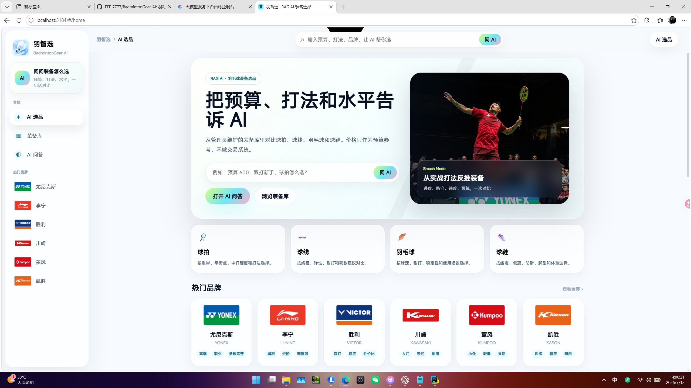
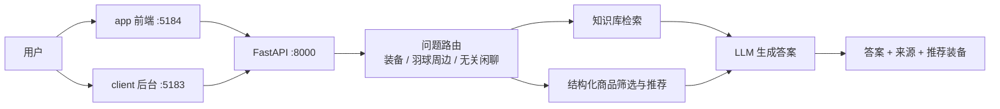
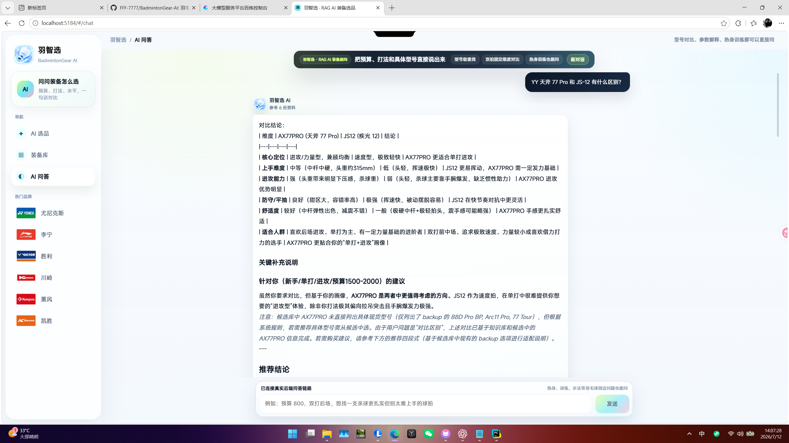
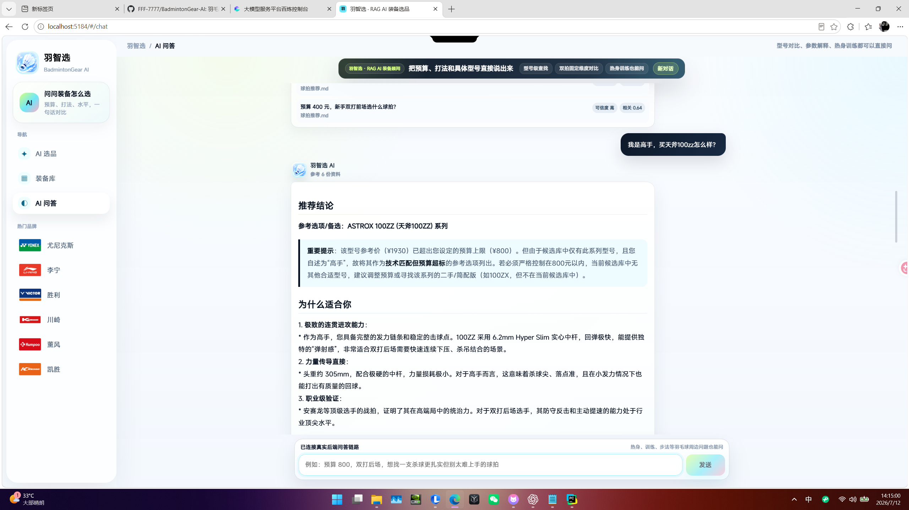
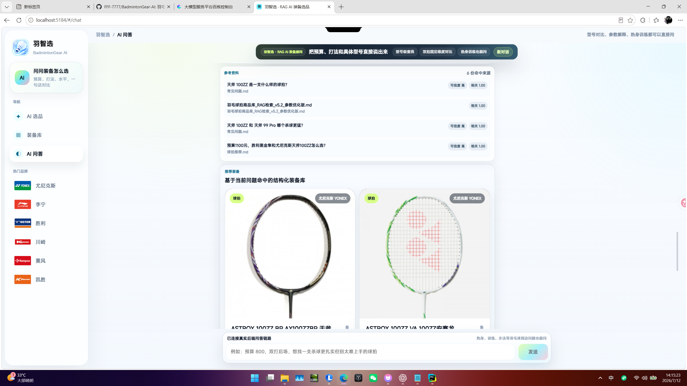
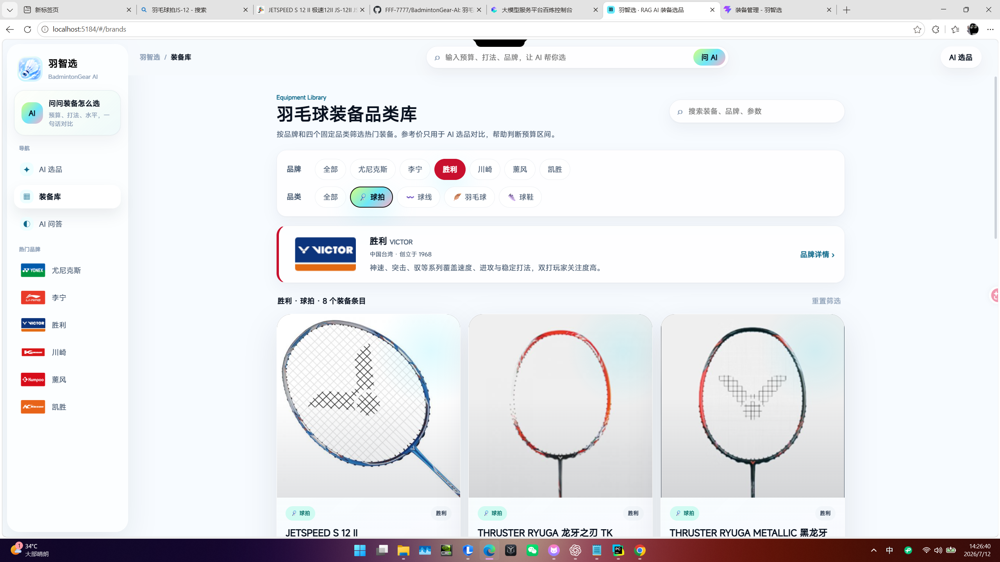
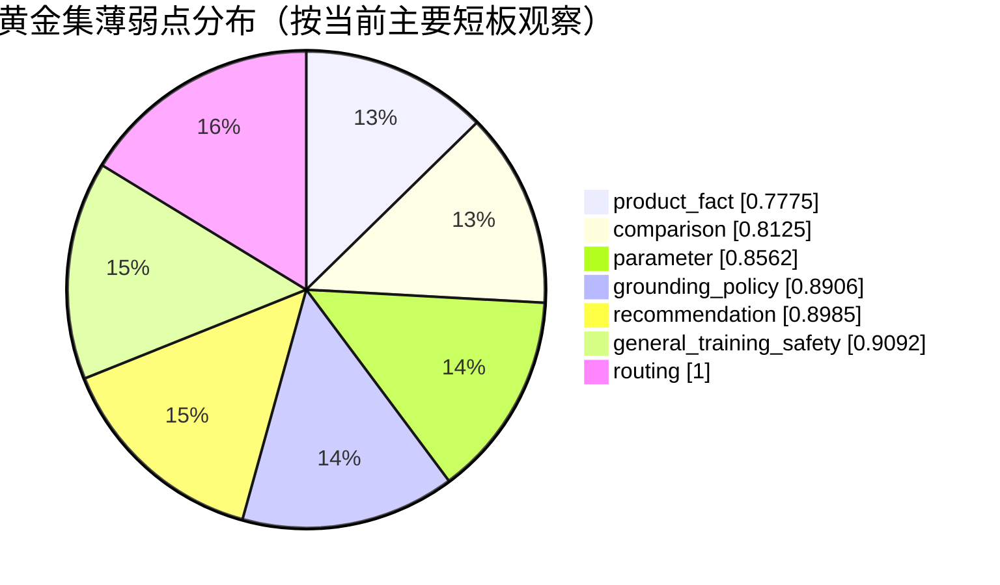

# 羽智选 · BadmintonGear AI

<p align="center">
  
</p>

<p align="center">
  面向羽毛球装备选购的 RAG 智能导购系统，聚焦球拍推荐、型号对比、参数解释与来源可追溯。
</p>

<p align="center">
  
  
  
  
  
  
</p>

## 项目简介

羽智选是一个围绕羽毛球装备决策设计的 AI 导购系统。用户可以直接用自然语言描述预算、水平、单双打场景、打法偏好和身体负担，系统会结合知识库检索、结构化商品库筛选和推荐规则，输出更克制、可解释、可追溯的选拍建议。 

这个项目当前的重点不是“泛聊天”，而是把装备问答做好，尤其是以下几类高频问题：

- 具体型号能不能查到
- 两支球拍能不能稳定对比
- 新手、进攻型、手腕弱、双打后场这类画像能不能给出更靠谱的推荐
- 当知识库没有足够证据时，能不能明确说不知道，而不是编参数

## 核心价值

- `RAG + 结构化商品库` 双路径协同，不只靠大模型自由发挥
- 优先处理 `型号查询`、`型号对比`、`选拍推荐`、`参数解释`
- 支持展示 `参考资料`、`推荐装备` 和问题命中的知识来源
- 明确业务边界：`不做交易`、`不报全网最低价`、`不承诺发货/售后`
- 羽毛球周边问题如热身、基础训练可以回答，但会提示不替代医生或教练

## 系统结构

| 模块 | 技术栈 | 端口 | 说明 |
| --- | --- | --- | --- |
| `app/` | Vue 3 + Vite | `5184` | 面向用户的 AI 导购前端 |
| `client/` | Vue 3 + Element Plus + Pinia | `5183` | 后台管理端 |
| `server/` | FastAPI + SQLAlchemy | `8000` | 问答、检索、推荐与管理 API |



## 产品界面

### 1. 用户端首页

<p align="center">
  
</p>

首页突出两件事：一是让用户直接进入 AI 选品，二是把装备库和品牌入口放在同一层，适合“先逛再问”和“直接提问”两种使用习惯。

### 2. AI 问答与型号对比

<p align="center">
  
</p>

针对 `YY 天斧 77 Pro 和 JS-12 有什么区别` 这类问题，系统会优先走型号识别和对比分支，而不是只给泛泛而谈的选拍建议。

### 3. 推荐型回答

<p align="center">
  
</p>

推荐回答会按固定结构输出，尽量把“为什么适合你”和“为什么不建议你直接上高门槛型号”说清楚。

### 4. 来源与推荐装备卡

<p align="center">
  
</p>

这部分把知识来源和推荐结果拆开展示，避免流式输出时文字和商品卡互相挤压，也更方便用户自己判断答案可信度。

### 5. 装备库浏览

<p align="center">
  
</p>

装备库支持按品牌和品类浏览，适合不确定具体型号、先想看一圈热门装备的用户。

## 后台管理

### 装备管理

<p align="center">
  
</p>

后台可以直接维护装备、图片、系列、品类和参考价，也预留了 Excel/CSV 导入入口，便于后续批量补数据。

### 知识库管理

<p align="center">
  
</p>

知识库页展示了文件总数、向量化进度和分块数量。当前截图对应 `8` 个文件、`3024` 个知识分块。

### 数据看板

<p align="center">
  
</p>

看板用于观察装备条目、知识库状态和 AI 会话规模，方便后续做运营和质量回归。

## RAG 设计重点

### 1. 问题分流

系统不会把所有问题都丢给同一条链路，而是先判断：

- `装备导购`
- `羽毛球周边知识`
- `无关闲聊`

这样可以减少“明明在问选拍，却被当成闲聊打发掉”的情况。

### 2. 型号优先

对于 `AX77 Pro`、`JS-12`、`65Z3`、`Turbocharging N7` 这类问题，系统优先做型号词识别、别名归一和结构化命中，再让 RAG 去补充解释，而不是单纯依赖模糊语义召回。

### 3. 对比优先

对 `A 和 B 怎么选`、`A 对比 B`、`A 还是 B` 这类问题，会优先进入固定维度的对比分支，避免答成一段泛推荐文案。

### 4. 边界明确

系统当前不会做以下承诺：

- 不提供实时最低价
- 不帮用户下单或承诺发货
- 不把论坛口碑直接当成确定事实
- 不在缺少证据时编造具体参数

## 评测结果

本项目不是只看“能不能跑”，而是把问答质量做成可回归评估。当前 README 使用了两套结果：

- `规则黄金集评测`
- `DeepEval 语义评测`

### 黄金集总览

数据集：`64` 条球拍场景测试用例  
文件：`badminton_rag_golden_set_v1_1_racket_only.jsonl`

| 指标 | 结果 |
| --- | --- |
| `overall_score` | **0.8816** |
| `pass_rate >= 0.80` | **76.56%** |

### 黄金集分组可视化

| 维度 | 分数 | 可视化 |
| --- | ---: | --- |
| routing | `1.0000` | `██████████` |
| general_training_safety | `0.9092` | `█████████░` |
| recommendation | `0.8985` | `█████████░` |
| grounding_policy | `0.8906` | `█████████░` |
| parameter | `0.8562` | `████████░░` |
| comparison | `0.8125` | `████████░░` |
| product_fact | `0.7775` | `███████░░░` |



当前最需要继续优化的是：

- `product_fact`：商品事实题还要继续提升来源命中与保守表达
- `comparison`：型号对比已经能答，但固定维度一致性还可以更强

### DeepEval 结果

裁判模型：`qwen3.6-flash-2026-04-16`

| 指标 | 分数 | 说明 |
| --- | ---: | --- |
| Faithfulness | `0.8142` | 忠实度 |
| Answer Relevancy | `0.8371` | 回答相关性 |
| Contextual Precision | `0.7906` | 上下文精度 |
| Contextual Recall | `0.8024` | 上下文召回 |
| Hallucination | `0.2008` | 幻觉率，越低越好 |
| 专业度 GEval | `0.8407` | 专业表达质量 |

> 这两套评测一起看，比单独看模型“感觉答得不错”更可靠。它能帮助我们定位到底是路由、召回、事实约束，还是推荐模板出了问题。

## 当前业务边界

为了让结果更可信，当前版本明确收窄了能力边界：

- 具体型号推荐目前主打 `羽毛球拍`
- `球线 / 球鞋 / 羽毛球` 暂不做高可信具体型号推荐
- 价格只作为 `预算参考`，不代表实时成交价
- 不做交易系统，不处理下单、库存、发货、售后

## 本地运行

### 后端

```bash
cd server
pip install -r requirements.txt
python main.py
```

### 用户前端

```bash
cd app
npm install
npm run dev
```

### 后台前端

```bash
cd client
npm install
npm run dev
```

启动后默认访问：

- 用户端：`http://127.0.0.1:5184`
- 管理端：`http://127.0.0.1:5183`
- 后端：`http://127.0.0.1:8000`

## 目录说明

```text
app/                 用户端前端
client/              后台管理端
server/              FastAPI 后端
docs/screenshots/    README 使用的真实界面截图
知识库/               RAG 知识文档
黄金集/               评测数据与报告
scripts/             维护与备份脚本
```

## 说明

本项目当前是面向作品集与工程化演示的私有项目形态。若你在阅读这份 README，最值得关注的不是“模型多强”，而是它如何把 `检索`、`推荐`、`边界控制` 和 `评估闭环` 组合成一个更可信的 AI 应用。
